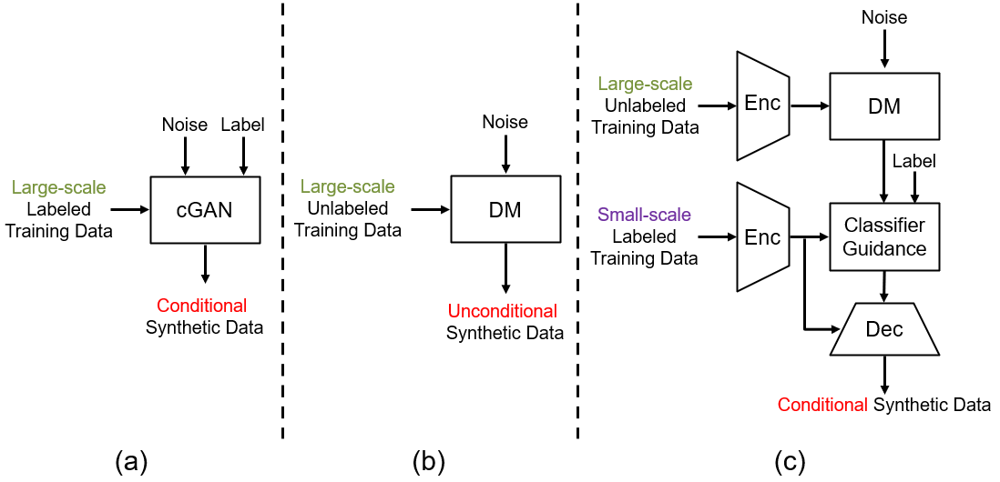
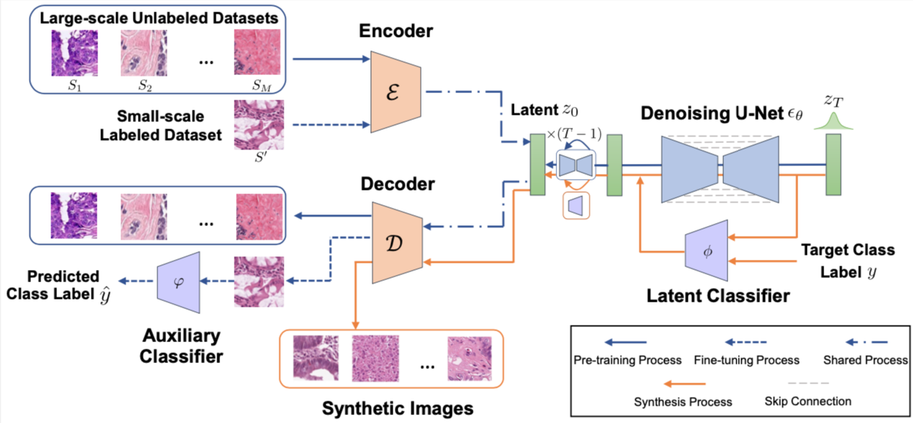
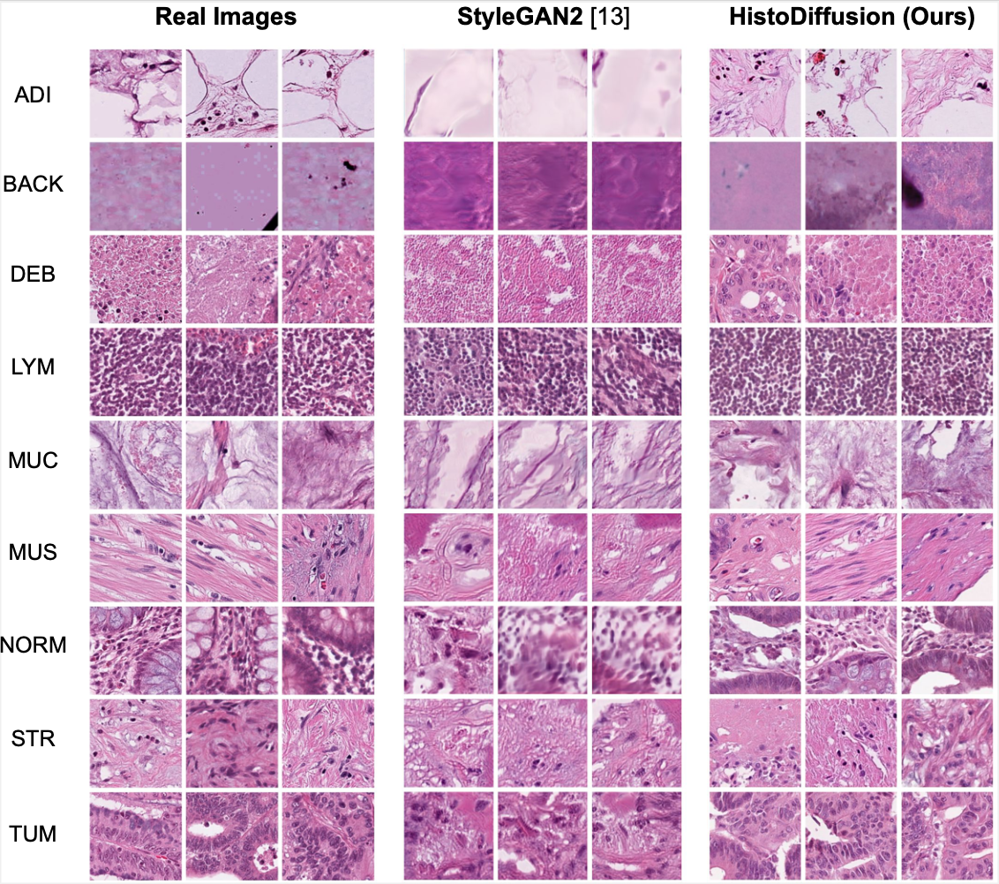

### Wrapping up, almost done

# Synthetic Augmentation with Large-scale Unconditional Pre-training

This repository contains the code used in the MICCAI 23' paper titled "Synthetic Augmentation with Large-scale
Unconditional Pre-training".

## Abstract

Deep learning based medical image recognition systems often require a substantial amount of training data with expert annotations, which can be expensive and time-consuming to obtain. Recently, synthetic augmentation techniques have been proposed to mitigate the issue by generating realistic images conditioned on class labels. However, the effectiveness of these methods heavily depends on the representation capability of the trained generative model, which cannot be guaranteed without sufficient labeled training data. To further reduce the dependency on annotated data, we propose a synthetic augmentation method called HistoDiffusion, which can be pre-trained on large-scale unlabeled datasets and later applied to a small-scale labeled dataset for augmented training. In particular, we train a latent diffusion model (LDM) on diverse unlabeled datasets to learn common features and generate realistic images without conditional inputs. Then, we fine-tune the model
with classifier guidance in latent space on an unseen labeled dataset so that the model can synthesize images of specific categories. Additionally, we adopt a selective mechanism to only add synthetic samples with high confidence of matching to target labels. We evaluate our proposed method by pre-training on three histopathology datasets and testing on a histopathology dataset of colorectal cancer (CRC) excluded from the pre-training datasets. With HistoDiffusion augmentation, the classification accuracy of a backbone classifier is remarkably improved by 6.4% using a small set of the original labels.

## Model Architecture





## Results visualization




## Package Requirements

  - python=3.8.5
  - pip=20.3
  - cudatoolkit=11.0
  - pytorch=1.7.0
  - torchvision=0.8.1
  - numpy=1.19.2
  - albumentations==0.4.3
  - opencv-python==4.1.2.30
  - pudb==2019.2
  - imageio==2.9.0
  - imageio-ffmpeg==0.4.2
  - pytorch-lightning==1.4.2
  - omegaconf==2.1.1
  - test-tube>=0.7.5
  - streamlit>=0.73.1
  - einops==0.3.0
  - torch-fidelity==0.3.0
  - transformers==4.3.1
  - taming-transformers
  - clip

## Usage

### autoencoder training

```python
python main.py --base configs/autoencoder/autoencoder_histo_kl_64x64x3.yaml -t --gpus 0,1,2,3
```


### diffusion training 

```python
python main.py --base configs/latent-diffusion/histo-ldm-kl-8.yaml -t --gpus 0,1,2,3
```


### classifier training

```python
CUDA_VISIBLE_DEVICES=0 python classifier_train.py --data_dir /data/karenyyy/CRC_Data/train5 \
                                    --val_data_dir /data/karenyyy/CRC_Data/val \
                                    --iterations 300000 \
                                    --anneal_lr True \
                                    --batch_size 32 \
                                    --lr 5e-5 \
                                    --save_interval 10000 \
                                    --weight_decay 0.05 \
                                    --image_size 256 \
                                    --classifier_attention_resolutions 32,16 \
                                    --classifier_depth 2 \
                                    --classifier_width 128 \
                                     --classifier_pool attention \
                                    --classifier_resblock_updown True \
                                    --classifier_use_scale_shift_norm True
```


### DDIM sampling

```python
python sample_diffusion.py -r /data/histo_diffusion_augmentation/diffusion_model.ckpt -n 10 -c 10
```


### evaluation 


#### centroid feature extraction and umap visualization 

```python
python vis.py
```


#### centroid-based filtering

```python
python distance.py
```


#### crc 9 class classification

```python
CUDA_VISIBLE_DEVICES=0 python eval.py \
                                --arch 'vit_small' \
                                --data_path /data/karenyyy/CRC_Data \
                                --output_dir train5+noft_randomfake50%
```


## Citation

If you use this code in your own research, please cite the following paper:

```
@inproceedings{ye2023synthetic,
  title={Synthetic Augmentation with Large-Scale Unconditional Pre-training},
  author={Ye, Jiarong and Ni, Haomiao and Jin, Peng and Huang, Sharon X and Xue, Yuan},
  booktitle={International Conference on Medical Image Computing and Computer-Assisted Intervention},
  pages={754--764},
  year={2023},
  organization={Springer}
}
```


## Contact

For any questions or inquiries, please send email to `jxy225@psu.edu`.
